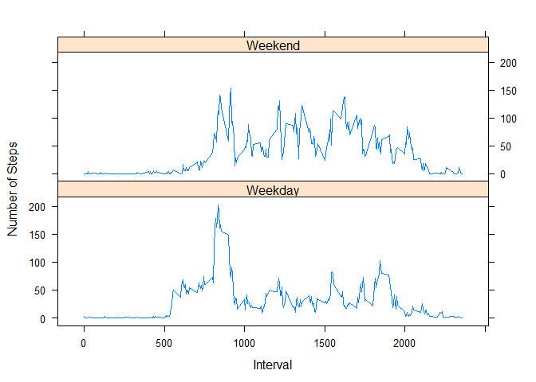

# Reproducible Research: Peer Assessment 1

This project will demonstrate the use of knitr to produce a document that shows both results and method in evaluating a particular data set. Here the data to be evaluated is activity data from a wearable sports monitor. First, we load the libraries that we will use throughout this document.

```r
library(ggplot2)
```

```
## Warning: package 'ggplot2' was built under R version 3.2.5
```

```r
library(lattice)
```

## Loading and preprocessing the data

To begin the assigment we will unzip the activity data and load the csv file into a data frame.

```r
unzip("activity.zip")
activity<-read.csv("activity.csv")
```

Now that the data has been unzipped and loaded into R, lets look at a summary of the data frame.

```r
summary(activity)
```

```
##      steps                date          interval     
##  Min.   :  0.00   2012-10-01:  288   Min.   :   0.0  
##  1st Qu.:  0.00   2012-10-02:  288   1st Qu.: 588.8  
##  Median :  0.00   2012-10-03:  288   Median :1177.5  
##  Mean   : 37.38   2012-10-04:  288   Mean   :1177.5  
##  3rd Qu.: 12.00   2012-10-05:  288   3rd Qu.:1766.2  
##  Max.   :806.00   2012-10-06:  288   Max.   :2355.0  
##  NA's   :2304     (Other)   :15840
```


## What is mean total number of steps taken per day?

Now we want to answer the questions in the assignment. First, the total number of steps per day taken is: 

```r
totalStepsPerDay<-aggregate(activity$steps,list(activity$date),FUN=sum,na.rm=TRUE)
totalStepsPerDay$x
```

```
##  [1]     0   126 11352 12116 13294 15420 11015     0 12811  9900 10304
## [12] 17382 12426 15098 10139 15084 13452 10056 11829 10395  8821 13460
## [23]  8918  8355  2492  6778 10119 11458  5018  9819 15414     0 10600
## [34] 10571     0 10439  8334 12883  3219     0     0 12608 10765  7336
## [45]     0    41  5441 14339 15110  8841  4472 12787 20427 21194 14478
## [56] 11834 11162 13646 10183  7047     0
```

We can also calculate the median and mean values of steps per day using:

```r
# Mean
mean(totalStepsPerDay$x)
```

```
## [1] 9354.23
```

```r
# Median
median(totalStepsPerDay$x)
```

```
## [1] 10395
```


Lastly, we want to plot a histogram of the steps taken during the data collection.


```r
totalStepsPerDay <- aggregate(activity$steps,list(activity$date),FUN=sum,na.rm=TRUE)
hist(totalStepsPerDay$x,xlab="steps",ylab = "Number of Days",main="Histogram of the number of steps per day")
```

<!-- -->

## What is the average daily activity pattern?

Now we want to see the average daily pattern of the wearer. We begin by plotting the steps on a lineplot. Here we overlay the pattern of steps for each available day

```r
ggplot(data=activity, aes(x=interval, y=steps))+geom_line(aes(col=date,group=date),lwd=1)+xlab("interval")+ylab("Number of Steps")+labs(title="Number of steps per interval per day")
```

<!-- -->

Having plotted the daily usage we now want to plot the average usage of the user. We will then be interested in in the interval during which the user is most active during the day. In this case, when on average is the user taking the most steps.


```r
# First we average the data across days to obtain the average number of steps
meanStep<-aggregate(activity$steps,list(activity$interval),FUN=mean,na.rm=TRUE)

# Now plot the average to see the step profile
plot(meanStep$x,type = 'l',ylab="Mean Number of Steps",xlab="Interval",main="Mean Number of Steps per Interval")
```

<!-- -->

```r
# now find the maximum value
max(meanStep$x,na.rm = TRUE)
```

```
## [1] 206.1698
```

```r
# Now we need the location of the maximum value in the data table
which.max(meanStep$x)
```

```
## [1] 104
```
This means that on average interval 104 has the most steps per day.


## Imputing missing values

We now move to the portion of the assignment where we will augment the data. First we need to determine how much data is missing. 

```r
# Determine how many NA values are in the data set
sum(is.na(activity$steps))
```

```
## [1] 2304
```

Now we want to substitute the missing values with the average value for this time interval across days. If the average value does not exist for this interval, then we replace NA with 0.

```r
# First we obtain the index of all the NA values
naIndex <- which(is.na(activity$steps)==TRUE) 

# Now for each NA value, find the corresponding interval and replace with the mean value for that interval
for(indx in naIndex){
  interval <- activity$interval[indx]
  intervalIndx <- which(interval %in% meanStep$Group.1)
  meanVal<- meanStep$x[intervalIndx]
  if(is.na(meanVal)==TRUE){
      activity$steps[indx] <- 0
  }else{
      activity$steps[indx] <- meanVal
  }
}
```

Now that the data set has been augmented by replacing the NA values with the mean value across dates or 0, lets replot the histogram we made earlier. Note here that many intervals did not have an average value. Consequently there are many 0s in the final data set.

```r
totalStepsPerDayFilledNA <- aggregate(activity$steps,list(activity$date),FUN=sum,na.rm=TRUE)
hist(totalStepsPerDayFilledNA$x,xlab="steps",ylab = "Number of Instances",main="Histogram of the number of steps")
```

<!-- -->

Then lets recalculate the mean and median.

```r
# Mean
mean(totalStepsPerDayFilledNA$x, na.rm = TRUE)
```

```
## [1] 9419.081
```

```r
# Median
median(totalStepsPerDayFilledNA$x, na.rm = TRUE)
```

```
## [1] 10395
```

Note here that the insertion of 0s for the intervals that have NA as a mean has slightly increased the mean number of steps taken by has not changed the median number of steps taken. This is very interesting because it suggests that while there appear to be many insertions of 0, the absense of values is symmetric throughout the day.

## Are there differences in activity patterns between weekdays and weekends?
We would like to know how the activity of the user varied between week days and weekends. To do this we will leverage the R function weekdays(). Lets first create a vector of weekdays from the dates in the activity date set.

```r
daysOfWeek<-weekdays(as.Date(activity$date))
```

Now we need to convert this vector such that it displays "weekday" for Monday through Friday and "weekend" for saturday anf sunday.

```r
for(index in 1:length(daysOfWeek) ){
  if(daysOfWeek[index] == "Saturday" || daysOfWeek[index]=="Sunday"){
    daysOfWeek[index]<-"Weekend"
  }else{
    daysOfWeek[index]<-"Weekday"
  }
}
```

Now that we have created the weekday/weekend vector, we append it to the data set.

```r
activity$dayOfWeek<-daysOfWeek
```

Finally we want to average the data frame to obtain the average user step profile for a weekend and for a weekday.

```r
totalStepsDayType<-aggregate(activity$steps,list(activity$dayOfWeek,activity$interval),FUN=sum,na.rm=TRUE)
```

Finally, we make a lattice plot to display the results of the averaged activity across the type of day. We note from the plots that the user is significantly less active on the weekends and in particular on the weekend mornings.

```r
xyplot(x~Group.2|Group.1,
       data = totalStepsDayType,
       type='l',layout=c(1,2),
       xlab='Interval',ylab='Number of Steps')
```

<!-- -->


